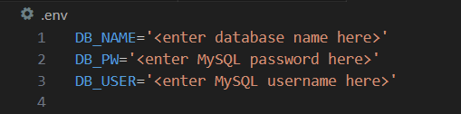
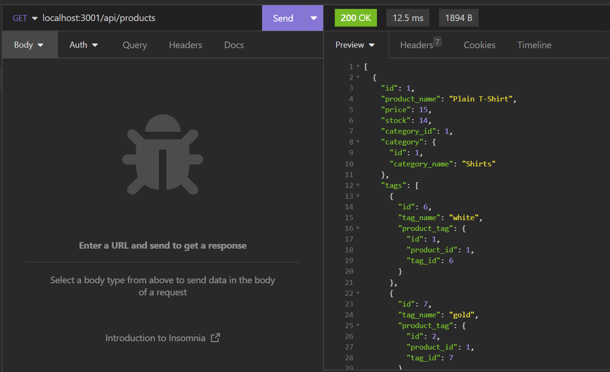

# E-Commerce-Back-End-API

## Description
An API which allows the user to interact with a database to read all data, update data, create new data, and delete data. This API is specifically designed to be useful for e-commerce using the latest technologies to improve performance and product management.

## Table of Contents
- [Installation](#installation)
- [Usage](#usage)
- [Credits](#credits)
- [License](#license)
- [Badges](#badges)
- [Tests](#tests)
- [Questions](#questions)

## Installation
To use this project, you will need to add the database name, MySQL username, and MySQL password to an environment variable file. 
     
Next, you will need to enter schema commands as well as install dependencies by entering the following commands from the root directory in the terminal:   `$ mysql -u root -p`   Type in your password if you have one   `$ source ./db/schema.sql;` 
To quit the MySQL shell you can type "quit".

## Usage
You can view a video demonstration of how to use this application [here](#).  
To run the program, use the following command from the root directory in the terminal:  `$ node server.js`  OR   `$ npm start`   The functionality of the application is demonstrated using Insomnia Core. You can find documentation on how to install Insomnia Core [here](https://docs.insomnia.rest/insomnia/install). If you need further information on how to use Insomnia Core, you can find the documentation [here](https://docs.insomnia.rest/insomnia/get-started). Using Insomnia Core, you can follow the appropriate api routes using GET, POST, PUT, and DELETE dropdown next to the address bar.  
      

## Credits
Tutorials Followed:  
[One To Many](https://sequelize.org/docs/v6/core-concepts/assocs/#:~:text=To%20create%20a%20One-To-One%20relationship%2C%20the%20hasOne%20and,Many-To-Many%20relationship%2C%20two%20belongsToMany%20calls%20are%20used%20together.)

## License
MIT License

## Badges

## Tests
N/A 

## Questions
GitHub Profile: [github.com/shannonkprice00](https://github.com/shannonkprice00) 
For further questions, you can reach me at shannonkprice00@gmail.com
